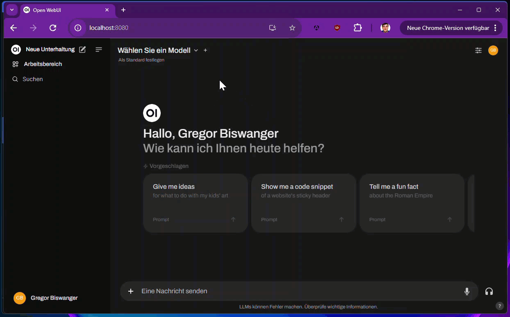

# OllamaApiFacade 🚀

**OllamaApiFacade** is an open-source library that allows you to run your own .NET backend as an Ollama API, based on the **Microsoft Semantic Kernel**. This lets clients expecting an Ollama backend interact with your .NET backend. For example, you can use **[Open WebUI](https://openwebui.com)** with your own backend. The library also supports Semantic Kernel Connectors for local LLM/SLM services like **LM Studio**, **AI Toolkit for Visual Studio Code** and is easily extendable to add more interfaces.



## Features ✨

- **Seamless Ollama Backend Integration**: OllamaApiFacade allows you to expose your .NET backend as a local Ollama API, making it compatible with Open WebUI solutions.
- **Microsoft Semantic Kernel Support**: Fully integrates with Semantic Kernel for building AI-based applications.
- **Extensible**: Easily add support for more interfaces through pull requests. Community contributions are highly encouraged!
- **Custom Modelname Support**: The library allows users to configure their own model names and backends.

## Installation 📦

You can install the **OllamaApiFacade** via [](https://www.nuget.org/packages/OllamaApiFacade/)

```bash
dotnet add package OllamaApiFacade
```

## Getting Started 🛠️

### Prerequisites

- .NET 8.0 or later
- Microsoft Semantic Kernel

### Simple Hello World Example 🌍

The following example demonstrates how to use the **OllamaApiFacade** with **Microsoft Semantic Kernel** and a local LLM/SLM service like **LM Studio**.

```csharp
using Microsoft.SemanticKernel;
using Microsoft.SemanticKernel.Connectors.OpenAI;
using OllamaApiFacade.DemoWebApi.Plugins;
using OllamaApiFacade.Extensions;

var builder = WebApplication.CreateBuilder(args);

// Configure Ollama API to use a local URL
builder.ConfigureAsLocalOllamaApi();

builder.Services.AddKernel()
    .AddLmStudio() // Adds LM Studio as the local LLM/SLM service
    .Plugins.AddFromType<TimeInformationPlugin>(); // Adds custom Semantic Kernel plugin

var app = builder.Build();

// Map the POST API for chat interaction
app.MapPostApiChat(async (chatRequest, chatCompletionService, httpContext, kernel) =>
{
    var chatHistory = chatRequest.ToChatHistory();

    var promptExecutionSettings = new OpenAIPromptExecutionSettings
    {
        FunctionChoiceBehavior = FunctionChoiceBehavior.Auto()
    };

    await chatCompletionService.GetStreamingChatMessageContentsAsync(chatHistory, promptExecutionSettings, kernel)
        .StreamToResponseAsync(httpContext.Response);
});

app.Run();
```

### Running Open WebUI with Docker 🐳

As an example, you can now run **Open WebUI** with Docker after setting up your backend. To do so, simply use the following Docker command:

```bash
docker run -d -p 8080:8080 --add-host=host.docker.internal:host-gateway --name open-webui ghcr.io/open-webui/open-webui:main
```

This command will start Open WebUI and make it accessible locally at `http://localhost:8080`. The `--add-host=host.docker.internal:host-gateway` flag is used to allow communication between the Docker container and your host machine.

For more detailed information on how to set up Open WebUI with Docker, including advanced configurations such as GPU support, please refer to the official [Open WebUI GitHub repository](https://github.com/open-webui/open-webui).

### Using Custom Model Names 🏷️

If you want to specify your own model names instead of relying on the default configuration, you can do this by using `MapOllamaBackendFacade`:

```csharp
var builder = WebApplication.CreateBuilder(args).ConfigureAsLocalOllamaApi();
var app = builder.Build();

// Map the Ollama backend with a custom model name
app.MapOllamaBackendFacade("mymodelname");

// Map the POST API for chat interaction
app.MapPostApiChat(async (chatRequest, chatCompletionService) =>
{
    // Your custom logic here...
});

app.Run();
```

### Note on `ConfigureAsLocalOllamaApi`

The `ConfigureAsLocalOllamaApi()` method automatically configures the backend to run on the URL `http://localhost:11434`, which is commonly used by Ollama. However, if you prefer to configure your own URL settings, you can do so by modifying the `launchSettings.json` file. In such cases, using `ConfigureAsLocalOllamaApi()` is not necessary, as your custom settings will take precedence.

### Custom Configuration via `launchSettings.json`

To modify the default URL, you can simply update the `launchSettings.json` file in your project as shown below:

```json
{
  "$schema": "http://json.schemastore.org/launchsettings.json",
  "profiles": {
    "http": {
      "commandName": "Project",
      "dotnetRunMessages": true,
      "launchBrowser": false,
      "launchUrl": "http://localhost:8080",
      "applicationUrl": "http://localhost:11434",
      "environmentVariables": {
        "ASPNETCORE_ENVIRONMENT": "Development"
      }
    }
  }
}
```

By adjusting the `applicationUrl`, you can set your own custom port, and the `ConfigureAsLocalOllamaApi()` method will no longer be required in the code.

### Handling Ollama Messages with Semantic Kernel 🧠

The **OllamaApiFacade** allows you to convert incoming messages from the Ollama format into Semantic Kernel data classes, such as using the `.ToChatHistory()` method to transform a chat request into a format that can be processed by the Semantic Kernel. Responses from the Semantic Kernel can then be converted back into the Ollama format using methods like `.StreamToResponseAsync()` or `.ToChatResponse()`, enabling seamless communication between the two systems.

Here's an example of how incoming messages are processed and transformed, with a response sent back in the Ollama format:

```csharp
app.MapPostApiChat(async (chatRequest, chatCompletionService, httpContext) =>
{
    var chatHistory = chatRequest.ToChatHistory();

    var messages = await chatCompletionService.GetChatMessageContentsAsync(chatHistory);
    var chatResponse = messages.First().ToChatResponse();
    
    chatResponse.StreamToResponseAsync(httpContext.Response);
});
```

In this example:

- The `chatRequest` is transformed into a `chatHistory` object using the `.ToChatHistory()` method, making it compatible with the Semantic Kernel.
- The Semantic Kernel processes the `chatHistory` and retrieves the chat messages.
- The first message in the list is converted back into an Ollama-compatible format using `.ToChatResponse()`.
- Finally, the response is serialized into JSON format and sent back to the client with `httpContext.Response.WriteAsync()`.

This ensures seamless communication between the Ollama client and the Semantic Kernel backend, allowing for the integration of advanced AI-driven interactions.

### Streaming Responses 📡

In this API, responses are typically expected to be streamed back to the client. To facilitate this, the `StreamToResponseAsync()` method is available, which handles the streaming of responses seamlessly. This method automatically supports a variety of data types from the Semantic Kernel, as well as direct `ChatResponse` types from Ollama. It ensures that the appropriate format is returned to the client, whether you're working with Semantic Kernel-generated content or directly with Ollama responses.

This method simplifies the process of returning streamed responses, making the interaction between the client and backend smooth and efficient.

### Debugging HTTP Communication with `AddProxyForDebug` 🐞

To inspect what data is being sent and received via HTTP to the language model APIs, you can use the `AddProxyForDebug` method. This is particularly useful for debugging with tools like **Burp Suite Community Edition** or **OWASP ZAP**.

#### How to Use
1. Add `AddProxyForDebug` to your service configuration:
   ```csharp
   builder.Services.AddProxyForDebug();
   ```
2. Start a local debugging tool such as Burp Suite Community Edition.

By default, the proxy listens on port `8080`. If **Open WebUI** or another service is already running on this port, update the port in Burp Suite or your chosen proxy tool and pass the new proxy URL to `AddProxyForDebug`:
   ```csharp
   builder.Services.AddProxyForDebug("http://127.0.0.1:8888");
   ```

#### Important Notes
- Make sure the proxy and your backend are not conflicting on the same port.
- This method is intended for development and debugging only. Avoid using it in production as it bypasses SSL validation.

Using this setup, you can see all HTTP requests and responses exchanged with the language model APIs, making it easier to debug and analyze the communication.

## Contributions 🤝

We encourage the community to contribute to this project! If there are additional features, interfaces, or improvements you would like to see, feel free to submit a pull request. Contributions of any kind are highly appreciated.

### How to Contribute 📝

1. Fork the repository on GitHub.
2. Create a new branch for your feature or bugfix.
3. Commit your changes and push the branch to GitHub.
4. Submit a pull request, and we will review it as soon as possible.

## License 📄

This project is licensed under the **MIT License**.

MIT License

Copyright (c) 2024 Gregor Biswanger - Microsoft MVP for Azure AI and Web App Development

## Acknowledgments 🙏

- [Microsoft Semantic Kernel](https://github.com/microsoft/semantic-kernel)
- [Open WebUI](https://openwebui.com)

For any questions or further details, feel free to open an issue on GitHub or reach out directly.
